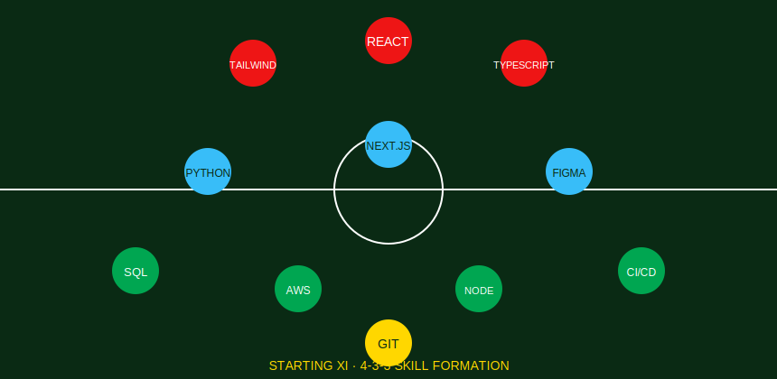
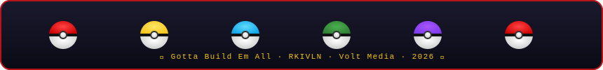

<!-- ═══════════════════════════════════════════════════════════ -->
<!--     GOKULAN ANBALAGAN  ·  WORLD CUP 2026 EDITION README     -->
<!--                   github.com/gokulan                        -->
<!-- ═══════════════════════════════════════════════════════════ -->

<!-- ══════════════════════ HERO BANNER ══════════════════════ -->

 

<i>🏆 FIFA WORLD CUP 2026 · USA · CANADA · MEXICO 🏆</i>

 

<!-- ═══════════════════ SQUAD ROLE BADGES ══════════════════ -->

 
 

<!-- ═══════════════════ STARTING XI / SKILLS ═══════════════ -->

 
 

<!-- ════════════════════ MATCH DAY LINEUP / PROJECTS ═══════ -->

\`\`\`
⚽━━━━━━━━━━━━━━━━━━━━━━ MATCH DAY LINEUP ━━━━━━━━━━━━━━━━━━━⚽
\`\`\`

<table>
<tr>
<td align="center" width="90">

🥅

 #01 · GK
</td>
<td>

**Project One** — *Clean Sheet Build*
Short description of what it does and the problem it solves.
`React` `Node.js` `PostgreSQL`
[Live Demo](#) · [Repo](#)

</td>
</tr>

<tr>
<td align="center" width="90">

🛡️

 #04 · DEF
</td>
<td>

**Project Two** — *Rock-Solid Backend*
Short description of what it does and the problem it solves.
`Next.js` `Tailwind` `Prisma`
[Live Demo](#) · [Repo](#)

</td>
</tr>

<tr>
<td align="center" width="90">

🎯

 #08 · MID
</td>
<td>

**Project Three** — *Playmaker Product*
Short description of what it does and the problem it solves.
`Python` `FastAPI` `AWS`
[Live Demo](#) · [Repo](#)

</td>
</tr>

<tr>
<td align="center" width="90">

⚡

 #09 · FWD
</td>
<td>

**Project Four** — *Golden Boot Contender*
Short description of what it does and the problem it solves.
`TypeScript` `Figma` `Vercel`
[Live Demo](#) · [Repo](#)

</td>
</tr>
</table>

⚽ Replace project names, descriptions, tech tags, and links with your real projects — add or remove rows as needed.

 
 

<!-- ════════════════════ GITHUB STATS ══════════════════════ -->

\`\`\`
⚽━━━━━━━━━━━━━━━━━━━━━ TOURNAMENT STATS ━━━━━━━━━━━━━━━━━━━━⚽
\`\`\`

&nbsp;

 
 

 
 

<!-- ═══════════════════ CONTRIBUTION MAP ═══════════════════ -->

\`\`\`
⚽━━━━━━━━━━━━━━━━━━━━━━ PITCH HEATMAP ━━━━━━━━━━━━━━━━━━━━━⚽
\`\`\`

 
 

<!-- ══════════════════ PAC-MAN / SNAKE ═════════════════════ -->

\`\`\`
⚽━━━━━━━━━━━━━━━━━━━ MATCHDAY POSSESSION MAP ━━━━━━━━━━━━━━━⚽
\`\`\`

<picture>
  <source media="(prefers-color-scheme: dark)"
          srcset="https://raw.githubusercontent.com/gokulan/gokulan/output/github-contribution-grid-snake-dark.svg"/>
  <source media="(prefers-color-scheme: light)"
          srcset="https://raw.githubusercontent.com/gokulan/gokulan/output/github-contribution-grid-snake.svg"/>
  
</picture>

 
 

<!-- ══════════════════ TROPHIES ════════════════════════════ -->

\`\`\`
⚽━━━━━━━━━━━━━━━━━━━━━━ TROPHY CABINET ━━━━━━━━━━━━━━━━━━━━━⚽
\`\`\`

 
 

<!-- ══════════════════ CONNECT ══════════════════════════════ -->

\`\`\`
⚽━━━━━━━━━━━━━━━━━━━━━━ TRANSFER TALKS ━━━━━━━━━━━━━━━━━━━━━⚽
\`\`\`

 
 

<!-- ══════════════════ FOOTER ══════════════════════════════ -->

 

