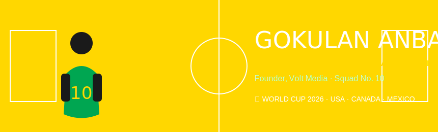

<!-- ═══════════════════════════════════════════════════════════ -->
<!--        GOKULAN ANBALAGAN  ·  POKÉMON EDITION README        -->
<!--                   github.com/gokulan                       -->
<!-- ═══════════════════════════════════════════════════════════ -->

<div align="center">

<!-- ══════════════════════ HERO BANNER ══════════════════════ -->



<br/>
<br/>

<!-- ═══════════════════ QUICK TYPE BADGES ══════════════════ -->


<br/>
<br/>

<!-- ═══════════════════ MOVE SET / SKILLS ══════════════════ -->


<br/>
<br/>

<!-- ════════════════════ POKÉDEX / PROJECTS ════════════════ -->


<br/>
<br/>

<!-- ════════════════════ GITHUB STATS ══════════════════════ -->

```
◈━━━━━━━━━━━━━━━━━━━━━━ BATTLE RECORD ━━━━━━━━━━━━━━━━━━━━━◈
```


&nbsp;


<br/>
<br/>


<br/>
<br/>

<!-- ═══════════════════ CONTRIBUTION MAP ═══════════════════ -->

```
◈━━━━━━━━━━━━━━━━━━━━ WILD ENCOUNTERS ━━━━━━━━━━━━━━━━━━━━━◈
```


<br/>
<br/>

<!-- ══════════════════ PAC-MAN / SNAKE ═════════════════════ -->

```
◈━━━━━━━━━━━━━━━━━━━ POKÉMON BATTLE FIELD ━━━━━━━━━━━━━━━━━◈
```

<picture>
  <source media="(prefers-color-scheme: dark)"
          srcset="https://raw.githubusercontent.com/gokulan/gokulan/output/github-contribution-grid-snake-dark.svg"/>
  <source media="(prefers-color-scheme: light)"
          srcset="https://raw.githubusercontent.com/gokulan/gokulan/output/github-contribution-grid-snake.svg"/>
  
</picture>

<br/>
<br/>

<!-- ══════════════════ TROPHIES ════════════════════════════ -->

```
◈━━━━━━━━━━━━━━━━━━━━━━━━ GYM BADGES ━━━━━━━━━━━━━━━━━━━━━━◈
```


<br/>
<br/>

<!-- ══════════════════ CONNECT ══════════════════════════════ -->

```
◈━━━━━━━━━━━━━━━━━━━━━━━ TRAINER LINKS ━━━━━━━━━━━━━━━━━━━━◈
```

[](https://github.com/gokulan)
[](https://instagram.com/voltmedia.in)
[](mailto:gokulan.rkivln@gmail.com)
[](https://linkedin.com/in/gokulan)

<br/>
<br/>

<!-- ══════════════════ FOOTER ══════════════════════════════ -->


<br/>


</div>

<!-- ═══════════════════════════════════════════════════════════ -->
<!--  SETUP INSTRUCTIONS (read this block, then delete it)      -->
<!--                                                            -->
<!--  1. Create a repo named exactly:  gokulan/gokulan          -->
<!--     (must match your GitHub username)                      -->
<!--                                                            -->
<!--  2. Upload these files to the ROOT of that repo:           -->
<!--       README.md   ← this file                              -->
<!--       banner.svg                                           -->
<!--       moveset.svg                                          -->
<!--       pokedex.svg                                          -->
<!--       footer.svg                                           -->
<!--                                                            -->
<!--  3. Replace every "gokulan" in badge/stats URLs with       -->
<!--     your actual GitHub username if different.              -->
<!--                                                            -->
<!--  4. For the contribution SNAKE animation, add this         -->
<!--     GitHub Action at:  .github/workflows/snake.yml         -->
<!--                                                            -->
<!--  name: Generate Snake                                      -->
<!--  on:                                                       -->
<!--    schedule:                                               -->
<!--      - cron: "0 0 * * *"                                   -->
<!--    workflow_dispatch:                                       -->
<!--  jobs:                                                     -->
<!--    generate:                                               -->
<!--      runs-on: ubuntu-latest                                -->
<!--      steps:                                                -->
<!--        - uses: Platane/snk@v3                              -->
<!--          with:                                             -->
<!--            github_user_name: ${{ github.repository_owner }}-->
<!--            outputs: |                                      -->
<!--              dist/github-contribution-grid-snake.svg       -->
<!--              dist/github-contribution-grid-snake-dark.svg?palette=github-dark -->
<!--        - uses: crazy-max/ghaction-github-pages@v3          -->
<!--          with:                                             -->
<!--            target_branch: output                           -->
<!--            build_dir: dist                                 -->
<!--          env:                                              -->
<!--            GITHUB_TOKEN: ${{ secrets.GITHUB_TOKEN }}       -->
<!-- ═══════════════════════════════════════════════════════════ -->
