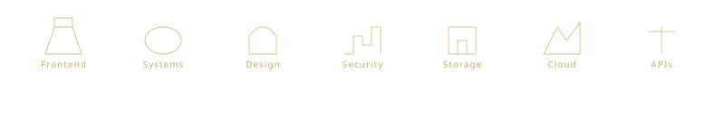
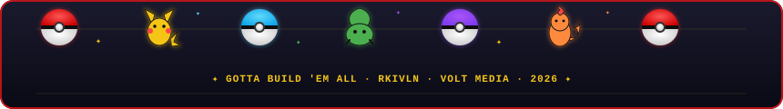

<!-- ═══════════════════════════════════════════════════════════ -->
<!--      GOKULAN ANBALAGAN  ·  TRAVEL JOURNAL EDITION         -->
<!--              github.com/gokulan · Traveller #0001          -->
<!-- ═══════════════════════════════════════════════════════════ -->

<!-- ══════════════════════ HERO BANNER ══════════════════════ -->

 
 

<!-- ═══════════════════ TECH BADGES ══════════════════════════ -->

 
 

<!-- ══════════════════ ANIMATED TRAVEL SCENE ══════════════ -->

 
 

<!-- ═══════════════════ SKILLS / DESTINATIONS ════════════ -->

 
 

<!-- ═══════════════════ PROJECTS / JOURNAL ════════════════ -->

 
 

<!-- ════════════════════ GITHUB STATS ════════════════════ -->

&nbsp;

 
 

 
 

<!-- ══════════════════ TROPHIES ══════════════════════════ -->

 
 

<!-- ══════════════════ ACTIVITY GRAPH ═══════════════════ -->

 
 

<!-- ══════════════════ CONTRIBUTION SNAKE ═══════════════ -->

<picture>
  <source media="(prefers-color-scheme: dark)"
          srcset="https://raw.githubusercontent.com/gokulan/gokulan/output/github-contribution-grid-snake-dark.svg"/>
  <source media="(prefers-color-scheme: light)"
          srcset="https://raw.githubusercontent.com/gokulan/gokulan/output/github-contribution-grid-snake.svg"/>
  
</picture>

 
 

<!-- ══════════════════ CONNECT ═══════════════════════════ -->

 
 

<!-- ══════════════════ FOOTER ═════════════════════════════ -->

 

<!-- ═══════════════════════════════════════════════════════════ -->
<!--           SETUP INSTRUCTIONS — DELETE AFTER SETUP          -->
<!-- ═══════════════════════════════════════════════════════════ -->
<!--                                                            -->
<!--  STEP 1 — Create the profile repo                          -->
<!--    Go to github.com/new and create a repo named exactly    -->
<!--    the same as your username:  gokulan/gokulan             -->
<!--    Make it Public, don't initialise with a README.         -->
<!--                                                            -->
<!--  STEP 2 — Upload all 6 files to the repo root             -->
<!--      README.md       ← this file                           -->
<!--      banner.svg      ← passport hero card                  -->
<!--      scene.svg       ← animated dusk seascape              -->
<!--      skills.svg      ← destination cards                   -->
<!--      journal.svg     ← travel journal project entries      -->
<!--      footer.svg      ← sign-off strip                      -->
<!--                                                            -->
<!--  STEP 3 — Contribution Snake Action                        -->
<!--    Create: .github/workflows/snake.yml                     -->
<!--                                                            -->
<!--  name: Generate Snake                                      -->
<!--  on:                                                       -->
<!--    schedule:                                               -->
<!--      - cron: "0 0 * * *"                                   -->
<!--    workflow_dispatch:                                       -->
<!--  jobs:                                                     -->
<!--    generate:                                               -->
<!--      runs-on: ubuntu-latest                                -->
<!--      permissions:                                          -->
<!--        contents: write                                     -->
<!--      steps:                                                -->
<!--        - uses: Platane/snk@v3                              -->
<!--          with:                                             -->
<!--            github_user_name: ${{ github.repository_owner}}-->
<!--            outputs: |                                      -->
<!--              dist/github-contribution-grid-snake.svg       -->
<!--              dist/github-contribution-grid-snake-dark.svg?palette=github-dark -->
<!--        - uses: crazy-max/ghaction-github-pages@v3          -->
<!--          with:                                             -->
<!--            target_branch: output                           -->
<!--            build_dir: dist                                 -->
<!--          env:                                              -->
<!--            GITHUB_TOKEN: ${{ secrets.GITHUB_TOKEN }}       -->
<!--                                                            -->
<!--  STEP 4 — Allow Actions                                    -->
<!--    Repo Settings → Actions → General →                     -->
<!--    "Allow all actions" + "Read and write permissions"      -->
<!--    Then trigger the workflow manually once.                -->
<!-- ═══════════════════════════════════════════════════════════ -->
