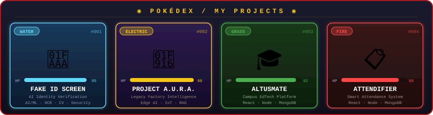

<!-- ═══════════════════════════════════════════════════════════ -->
<!--        GOKULAN ANBALAGAN · VICE CITY EDITION README        -->
<!--                 github.com/rkivln                           -->
<!-- ═══════════════════════════════════════════════════════════ -->

<!-- ═══════════════════════ HERO ═════════════════════════════ -->

 
 

<!-- ═══════════════════ TECH STACK ══════════════════════════ -->

 
 

<!-- ═════════════════════ PLAYER PROFILE ════════════════════ -->

 
 

<!-- ═══════════════════════ MISSIONS ════════════════════════ -->

 
 

<!-- ═════════════════════ GITHUB STATS ══════════════════════ -->

<h2>▰ DEVELOPER STATS</h2>

 
 

<!-- ═════════════════════ CONTRIBUTIONS ═════════════════════ -->

<h2>▰ ACTIVITY MAP</h2>

<picture>

  <source
    media="(prefers-color-scheme: dark)"
    srcset="https://raw.githubusercontent.com/rkivln/rkivln/output/github-contribution-grid-snake-dark.svg"/>

  <source
    media="(prefers-color-scheme: light)"
    srcset="https://raw.githubusercontent.com/rkivln/rkivln/output/github-contribution-grid-snake.svg"/>

  

</picture>

<!-- ═══════════════════════ SOCIALS ═════════════════════════ -->

<h2>▰ CONTACT</h2>

 
 

<!-- ═══════════════════════ FOOTER ══════════════════════════ -->

 

<!-- ═══════════════════════════════════════════════════════════ -->
<!--                     SETUP                                   -->
<!--                                                            -->
<!--  Repository: rkivln/rkivln                                -->
<!--                                                            -->
<!--  Files:                                                    -->
<!--                                                            -->
<!--    README.md                                               -->
<!--    banner.svg                                              -->
<!--    moveset.svg                                             -->
<!--    pokedex.svg                                             -->
<!--    footer.svg                                              -->
<!--                                                            -->
<!--  Replace usernames if required.                            -->
<!-- ═══════════════════════════════════════════════════════════ -->
